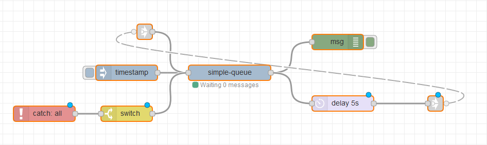

# node-red-contrib-simple-queue

Easy node-red queue to limit the messages processed at the same time.

## Example
```json
[{"id":"277be13c.821fae","type":"inject","z":"1a306382.5c1bdc","name":"","topic":"","payload":"","payloadType":"date","repeat":"","crontab":"","once":false,"onceDelay":0.1,"x":400,"y":460,"wires":[["68256c5.51cff14"]]},{"id":"68256c5.51cff14","type":"simple-queue","z":"1a306382.5c1bdc","count":"1","x":600,"y":460,"wires":[["52e8cd6a.81fc8c","f84323f.8cec4e"]]},{"id":"52e8cd6a.81fc8c","type":"debug","z":"1a306382.5c1bdc","name":"","active":true,"tosidebar":true,"console":false,"tostatus":false,"complete":"true","targetType":"full","x":810,"y":400,"wires":[]},{"id":"f84323f.8cec4e","type":"delay","z":"1a306382.5c1bdc","name":"","pauseType":"delay","timeout":"5","timeoutUnits":"seconds","rate":"1","nbRateUnits":"1","rateUnits":"second","randomFirst":"1","randomLast":"5","randomUnits":"seconds","drop":false,"x":820,"y":520,"wires":[["1bca43f6.0d5804"]]},{"id":"1bca43f6.0d5804","type":"link out","z":"1a306382.5c1bdc","name":"","links":["a8d107c3.1ad12"],"x":1000,"y":520,"wires":[]},{"id":"a8d107c3.1ad12","type":"link in","z":"1a306382.5c1bdc","name":"","links":["1bca43f6.0d5804"],"x":435,"y":380,"wires":[["68256c5.51cff14"]]},{"id":"475c35e2.c0af2c","type":"catch","z":"1a306382.5c1bdc","name":"","scope":null,"uncaught":false,"x":240,"y":540,"wires":[["ac8470d3.459d28"]]},{"id":"ac8470d3.459d28","type":"switch","z":"1a306382.5c1bdc","name":"","property":"queue_msg_id","propertyType":"msg","rules":[{"t":"nnull"}],"checkall":"true","repair":false,"outputs":1,"x":400,"y":540,"wires":[["68256c5.51cff14"]]}]
```
